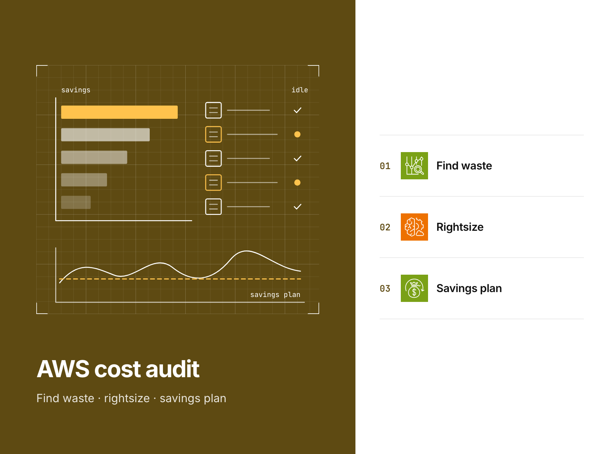
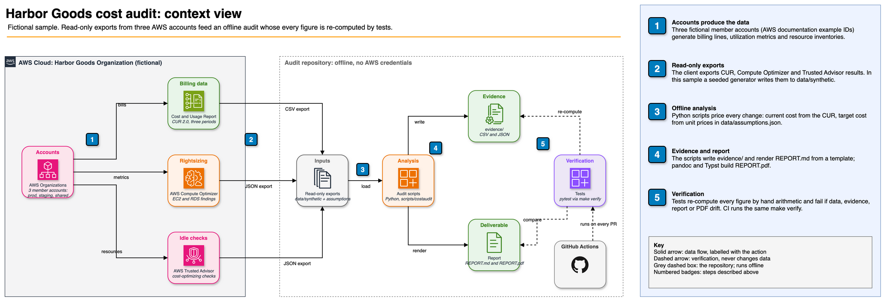

# AWS cost optimization audit sample

An offline AWS cost audit of a fictional retailer's billing data, with ranked savings and an action plan.

[](https://github.com/gamaware/aws-cost-optimization-audit-sample/actions/workflows/ci.yml)
[](LICENSE)




> **Fictional sample.** Harbor Goods and all data here are fictional. Each repository in this portfolio is a
> separate engagement with Harbor Goods, a fictional mid-size retailer. Account IDs are AWS documentation examples.
> Savings are estimates calculated from that data; none are measured results.

## Executive summary

Monthly AWS spending across Harbor Goods' three accounts totals $24,070.34, up 10.0% from two
months earlier. Across 16 opportunities, the audit estimates savings of
**$8,134.97 a month ($97,619.64 a year)**, equivalent to 33.8% of the bill.

| Group | Items | Estimated monthly saving |
| --- | ---: | ---: |
| Quick wins (low effort, low risk) | 10 | $3,889.12 |
| Planned work (load test, release or commitment) | 6 | $4,245.85 |
| **Total** | **16** | **$8,134.97** |

The three highest-ranked recommendations and their estimated monthly savings are:

1. Rightsize the production orders database: $1,693.60 per month.
2. Rightsize the staging orders database and remove its reader: $1,481.90 per month.
3. Rightsize over-provisioned EC2 instances: $840.96 per month.

The `cost-center` tag covers just 79.0% of spending; Savings Plans cover 8.9% of eligible compute.
Alongside its tagging and allocation plan, the report calculates new commitment sizes from the
usage that would remain after rightsizing.

## Inspect the deliverable

- [Read the audit](report/REPORT.md) or its [PDF version](report/REPORT.pdf) for the executive
  summary, savings ranking, quick wins and planned work, commitments, tagging, and all assumptions.
- [Review the savings calculations by resource](evidence/savings-detail.csv), with supporting
  outputs in [`evidence/`](evidence/).
- [Check the assumptions](data/assumptions.json) for unit prices and thresholds, plus each item's
  effort and risk ratings and their rationale.
- [Examine the analysis implementation](scripts/costaudit/) and
  [calculation tests](tests/test_numbers.py), which derive each saving again from hours, rates,
  and gigabytes.
- [Read how the audit works](docs/methodology.md).

## Scenario and acceptance criteria

The fictional mid-size retailer Harbor Goods uses AWS for its storefront, order API, batch
inventory synchronization, and small analytics warehouse. The orders database runs on Amazon Aurora
PostgreSQL. Production, staging, and shared services
each have an account. Bills have increased for three months without anyone owning the cost.
Read-only access limits the audit to inspection; it makes no changes.

Acceptance requires the following:

- A service and account breakdown shows spending trends and the largest changes.
- Billing data supports the pricing of idle and unattached resources, rightsizing candidates,
  and commitment coverage, with explicit assumptions.
- Each recommendation includes monthly and annual savings estimates, effort and risk ratings,
  and a quick-win or planned-work classification.
- A plan defines tagging and cost allocation.
- Running `make verify` offline reproduces all report figures from `data/`.

## Architecture



A deterministic generator creates billing lines, Compute Optimizer findings, and Trusted Advisor
checks for the three fictional accounts, representing exports an auditor would collect through
read-only access. Python scripts calculate the price of each change using the CUR for current
costs and `data/assumptions.json` for target costs. Their outputs populate `evidence/` and a report
rendered from a template. Both tests and CI execute `make verify`; any figure that diverges from
the data causes it to fail. The editable diagram is available at
[`docs/diagrams/audit-context.drawio`](docs/diagrams/audit-context.drawio).

## Verify locally

Local verification requires GNU Make and [uv](https://docs.astral.sh/uv/) 0.12 or later (CI pins 0.12.19).
uv installs Python 3.13 along with the tools pinned in `uv.lock`. Rebuilding the PDF additionally requires
Docker: `make pdf` runs the same pinned pandoc LaTeX image as CI.

```sh
uv sync --frozen
make verify
```

The final lines of a successful run are:

```text
data/synthetic matches the generator
evidence/ and report/REPORT.md match a fresh run of the audit
report/REPORT.pdf matches report/REPORT.md
verify: all checks passed
```

After the initial `uv sync`, verification finishes in less than a minute. To print the ranking,
run `make summary`. The `make evidence` target rebuilds the evidence, report, and PDF;
`make data` recreates the synthetic exports.

**Live smoke test (optional, manual).** Through the maintainer's `dev` profile, `make test-live`
makes read-only calls to a real account. After printing the caller identity, it verifies that
Cost Explorer and Compute Optimizer continue to supply the fields consumed by the audit. It also
checks that no resources tagged `purpose=portfolio-test` exist. The test creates no resources.
All output goes to a temporary directory removed on exit, and the cost is one Cost Explorer
request (USD 0.01). This test never runs in CI.

## Repository map

```text
data/synthetic/        generated exports: CUR extract, Compute Optimizer, Trusted Advisor, inventories
data/assumptions.json  unit prices, thresholds, effort and risk ratings
scripts/costaudit/     analysis: loading, findings, commitments, ranking, report rendering
scripts/*.py, *.sh     data generator, PDF builder, read-only live smoke test
evidence/              generated CSV and JSON behind every figure in the report
report/                REPORT.template.md (prose), REPORT.md and REPORT.pdf (generated)
tests/                 hand-arithmetic checks, data integrity, freshness of every output
docs/                  methodology, ADRs, diagrams, cover image
```

## Decisions and trade-offs

| ADR | Title | Status |
| --- | --- | --- |
| [0001](docs/adr/0001-generate-synthetic-exports.md) | Generate the synthetic exports from code | Accepted |
| [0002](docs/adr/0002-render-report-from-template.md) | Render the report from a template with no hand-typed figures | Accepted |
| [0003](docs/adr/0003-size-commitments-last.md) | Size commitments last, on the steady post-change baseline | Accepted |
| [0004](docs/adr/0004-pdf-from-markdown.md) | Build the PDF from the Markdown with the shared pandoc LaTeX image | Accepted |

## Security and quality gates

| Gate | Where | Why |
| --- | --- | --- |
| `make verify`: ruff, pytest, freshness of data, evidence, report and PDF | local and CI | The report can never disagree with the data |
| markdownlint | pre-commit and shared `lint-docs` workflow | Consistent, readable Markdown |
| lychee link check, Vale prose lint | shared `lint-docs` workflow | Working links, plain prose |
| actionlint, zizmor | pre-commit and shared `lint-actions` workflow | Safe workflows: SHA pins, least privilege |
| gitleaks, detect-secrets | pre-commit and shared `secrets` workflow | No credentials in a public repo |
| Semgrep, Trivy, Checkov | shared `security` workflow | Code, dependency and configuration scanning |
| Evidence regeneration and PDF render with the pinned pandoc LaTeX image | shared `report` workflow | Evidence reproduces from the committed scripts; the report renders |
| Hash of `REPORT.md` in the PDF keywords | `make verify` | The committed PDF was built from the reviewed Markdown |

Workflow-level `permissions: {}` applies to the CI jobs, which use no cloud credentials.

## Limits and production adaptations

- **Simulated:** all accounts, resources, and costs are fictional. The unit prices approximate
  on-demand list pricing in us-east-1; the Reserved Instance discount is an estimate for planning.
- **Aggregated:** each CUR extract line represents a resource, usage type, and month. Actual CUR
  data is hourly or daily. A real engagement would therefore use hourly minimums to establish
  the Savings Plan baseline rather than monthly presence.
- **Out of scope:** the audit excludes tax, credits, Support, Marketplace, Spot, multiple regions,
  containers, and data transfer architecture.
- **A real engagement adds:** read-only collection of exports and pricing from the Price List API.
  A readout with the client's engineers confirms effort and risk ratings. The Advanced tier of the
  matching service offer also includes infrastructure-as-code pull requests for the top changes and a
  follow-up cost report.

## Related work

Part of the [AWS DevOps portfolio](https://github.com/gamaware/aws-devops-portfolio); it backs the "AWS cost
optimization audit" service:
[AWS cost optimization audit on Upwork](https://www.upwork.com/freelancers/~014b3520cf9e140103). The method is the
one Alex uses in audits for ITESO and freelance clients in Guadalajara. Contribution, conduct and support guidelines
are inherited from [gamaware/.github](https://github.com/gamaware/.github); see also [SECURITY.md](SECURITY.md) and
[CHANGELOG.md](CHANGELOG.md).

## License

[MIT](LICENSE)
